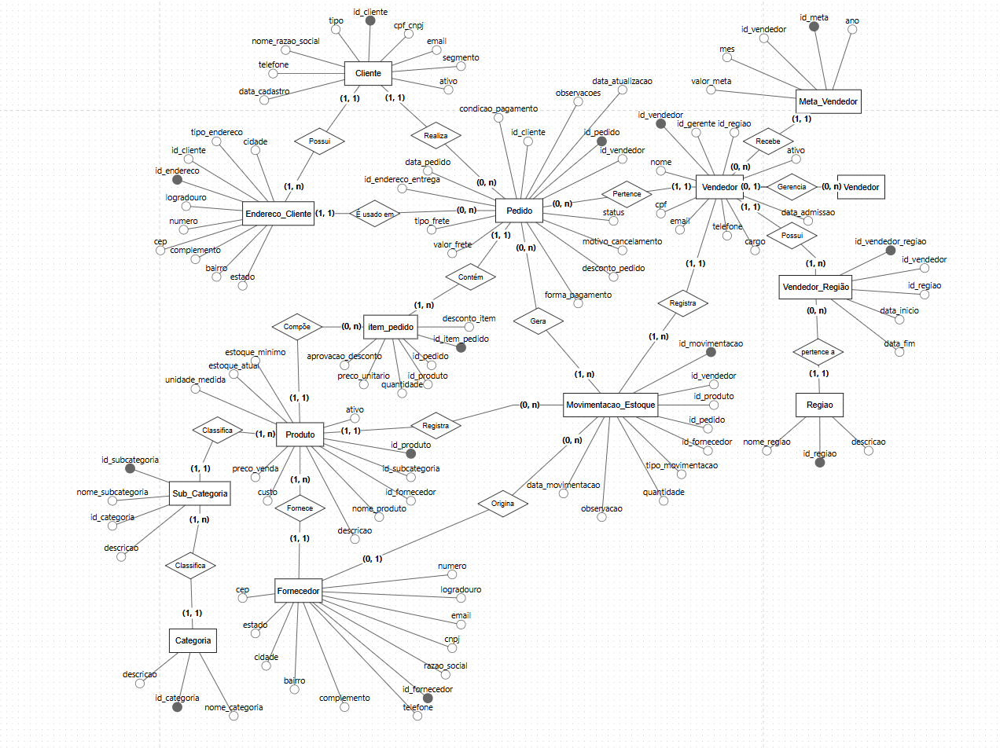
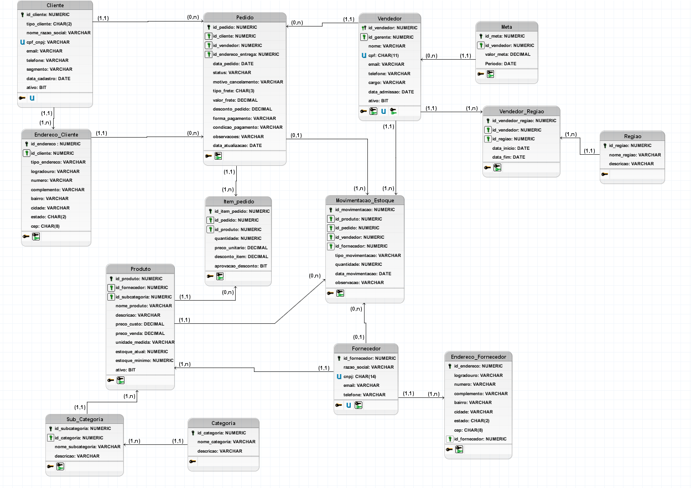
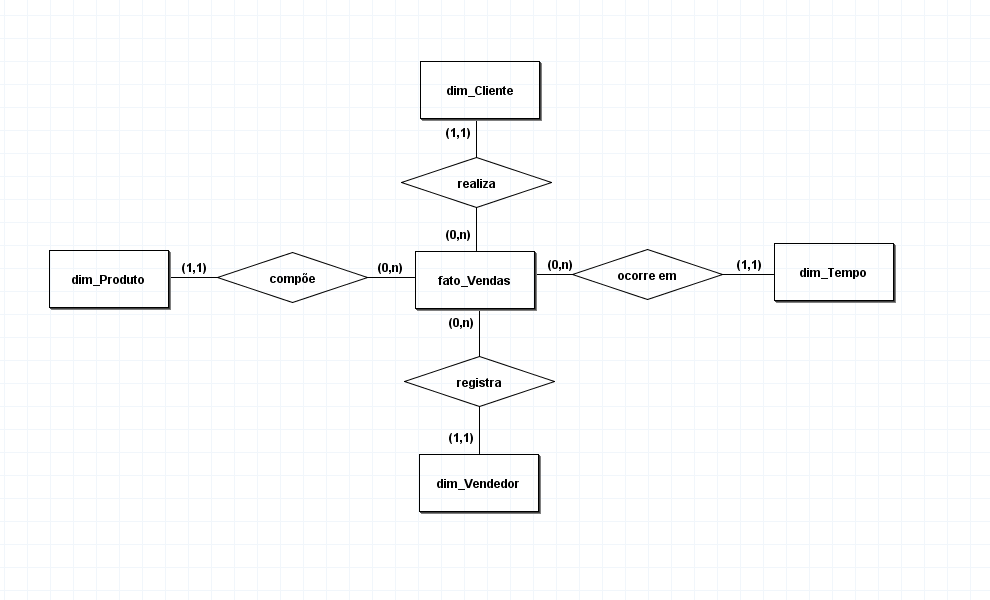
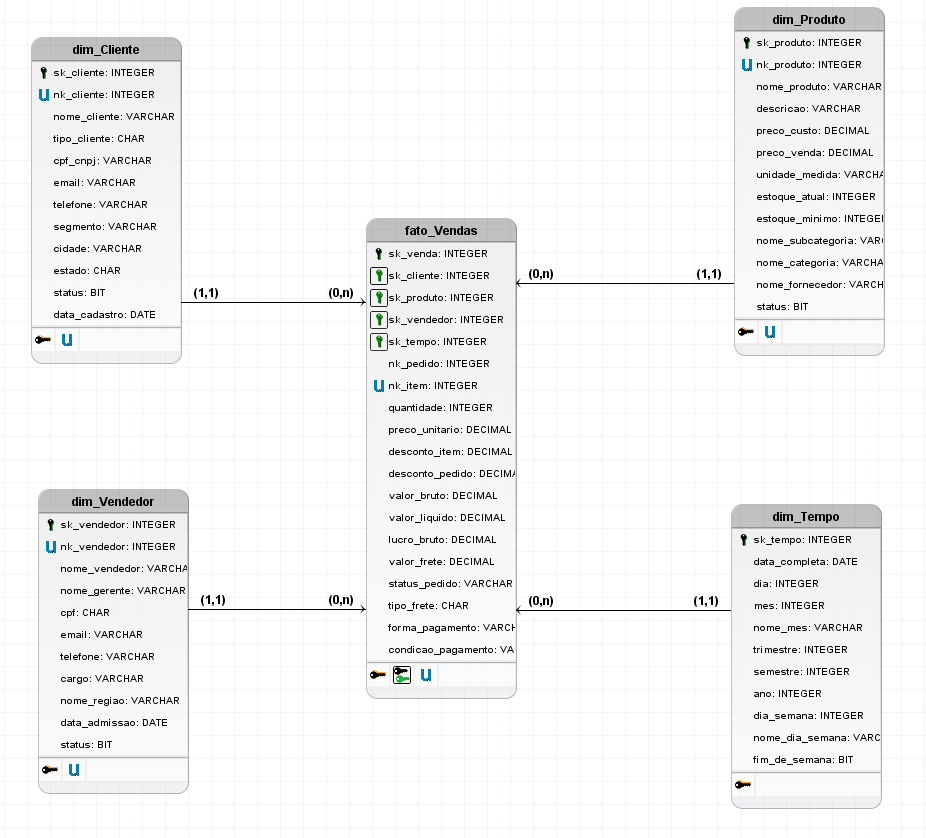
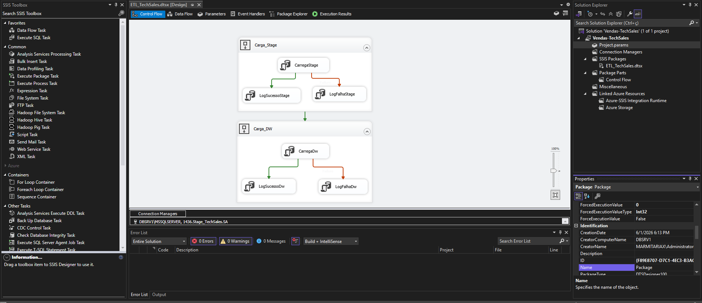
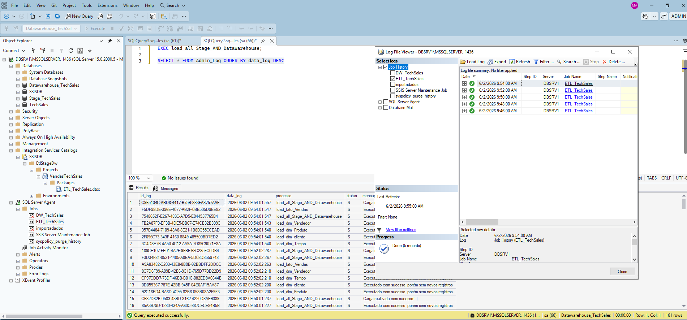
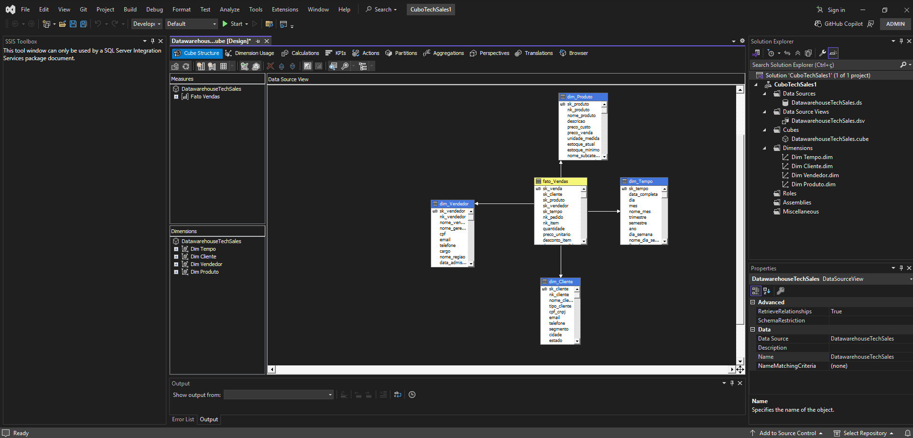
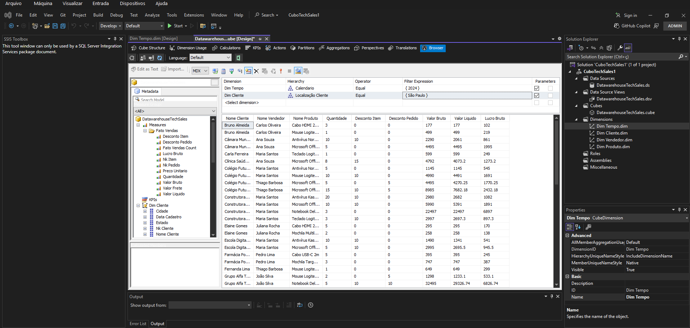

# TechSales Data Pipeline

## 📋 Sobre o Projeto
Pipeline completo de dados de uma distribuidora fictícia 
de tecnologia (TechSales Ltda), cobrindo todas as etapas 
de um projeto real de dados:
OLTP → Stage → DataWarehouse → ETL → BI

## 🏢 Contexto
A TechSales Ltda é uma distribuidora de produtos de 
tecnologia que controlava tudo em planilhas Excel.
O projeto resolve essa limitação implementando uma 
solução completa de dados.

## 🛠️ Tecnologias
- SQL Server
- SSMS (SGBD usado para gerenciamento dos dados)
- SSIS 
- SSAS
- SQL Server Agent (jobs)
- Power BI (em desenvolvimento)

## 📐 Arquitetura
OLTP → Stage → DataWarehouse → Power BI

## ✅ Etapas Concluídas

### 01 - OLTP ✅
- Modelagem Conceitual MER e DER (notação Peter Chen)
- Modelagem Lógica com normalização 1FN, 2FN e 3FN
- Modelo Físico com 4 schemas e 14 tabelas
- Constraints: PK, FK, UNIQUE, CHECK, DEFAULT
- Queries níveis básico ao avançado
- 4 Views analíticas
- 2 Triggers
- 1 Stored Procedure
- 5 Views de extração para o Stage

## 📐 Modelagem OLTP

### Modelo Conceitual — DER


### Modelo Lógico


### 02 - Stage ✅
- Banco Stage_TechSales criado
- 5 tabelas de staging no schema dbo (Será criado Schema stage futuramente)
- Procedure de carga com log de auditoria
- Admin_Log para rastreabilidade das cargas

### 03 - DataWarehouse ✅
- Banco Datawarehouse_TechSales criado
- Modelagem Star Schema
- 4 dimensões: dim_Cliente, dim_Produto,
dim_Vendedor, dim_Tempo
- 1 tabela fato: fato_Vendas
- Admin_Log para rastreabilidade das cargas
- 5 Procedures de carga ETL Stage → DW:
- load_dim_Tempo
- load_dim_Cliente
- load_dim_Produto
- load_dim_Vendedor
- load_fato_Vendas

### Procedure Master de Carga
```sql
-- Executa todo o pipeline em sequência
EXEC load_all_Stage_AND_Datawarehouse

-- Fluxo executado:
-- 1. Carrega Stage a partir das views do OLTP
-- 2. Carrega dim_Cliente
-- 3. Carrega dim_Produto  
-- 4. Carrega dim_Vendedor
-- 5. Carrega dim_Tempo
-- 6. Carrega fato_Vendas
```

### ⚠️ Observação sobre carga incremental
Em produção as views de extração seriam
adaptadas para buscar apenas registros
do dia anterior via filtro de data.
Por se tratar de ambiente de testes e estudos
a carga foi implementada como full load
com WHERE NOT EXISTS no DW garantindo
idempotência sem duplicação.

## 📐 Modelagem DataWarehouse

### Modelo Conceitual — Star Schema


### Modelo Lógico DW


### 04 - SSIS ✅
- Pacote ETL criado no Visual Studio
- Connection Managers configurados:
  TechSales_OLTP, Stage_TechSales, 
  Datawarehouse_TechSales
- Fluxo do pacote:
  → Container Carga Stage: Execute SQL → Carrega_Stage_TechSales
  → Container Carga Data Warehouse: Execute SQL → load_all_Stage_AND_Datawarehouse
- Log de sucesso e falha em cada etapa
- Agendamento via SQL Server Agent Job
  executado diariamente às 01:00 AM

### Fluxo Completo


### Job rodando o pacote


### 05 - SSAS ✅
- Projeto Multidimensional criado no Visual Studio
- Data Source conectado ao Datawarehouse_TechSales
- Data Source View com Star Schema completo
- 4 Dimensões criadas:
  → dim_Cliente  
  → dim_Produto  
  → dim_Vendedor 
  → dim_Tempo    
- Hierarquias criadas:
  → Localização Cliente (Estado → Cidade)
  → Classificacao Produto (Categoria → Subcategoria → Produto)
  → Equipe Vendas (Região → Cargo → Vendedor)
  → Calendario (Ano → Semestre → Trimestre → Mês → Dia)
- Medidas do cubo:
  → Faturamento (SUM valor_liquido)
  → Valor Bruto (SUM valor_bruto)
  → Lucro Bruto (SUM lucro_bruto)
  → Quantidade Vendida (SUM quantidade)
  → Valor Frete (SUM valor_frete)
  → Total Pedidos (COUNT DISTINCT nk_pedido)
- Cubo deployado e processado no servidor SSAS
- Pacote SSIS criado para processamento
  automático do cubo via SQL Server Agent Job
  executado diariamente às 02:00

  ### Visual Cubo


### Browse Cubo


## ⚙️ Automação — SQL Server Agent Jobs

### JOB 1 — Carga Diária ETL
- Horário: 01:00
- Executa: ETL_TechSales.dtsx
  → Carrega Stage a partir do OLTP
  → Carrega dimensões e fato do DW

### JOB 2 — Processamento do Cubo SSAS
- Horário: 02:00
- Executa: Processa_Cubo.dtsx
  → Processa o cubo após carga do DW
  → Garante dados atualizados no Power BI

### 06 - Power BI ✅
- Dashboard conectado ao cubo SSAS
- 4 páginas analíticas:
  → Visão Geral — KPIs, faturamento mensal,
    Status Pedidos
  → Vendas & Faturamento — análise por cliente,
    segmento e forma de pagamento
  → Produtos & Estoque — ranking de produtos,
    lucro e estoque crítico
  → Vendedores & Metas — desempenho vs meta
    e ranking de vendedores

## 📁 Estrutura do Repositório
01-oltp/          → Banco operacional
02-stage/         → Banco de staging
03-datawarehouse/ → Banco analítico
04-ssis/          → Pacotes ETL
05-ssas/          → Cubos de Dados
06-power bi\      → Dashboard Power BI
docs/             → Diagramas e documentação
